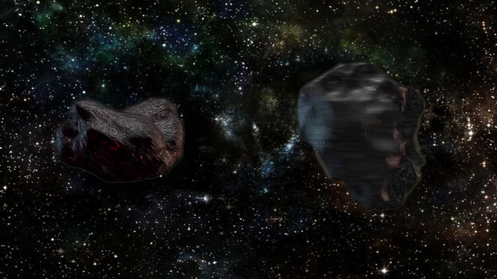
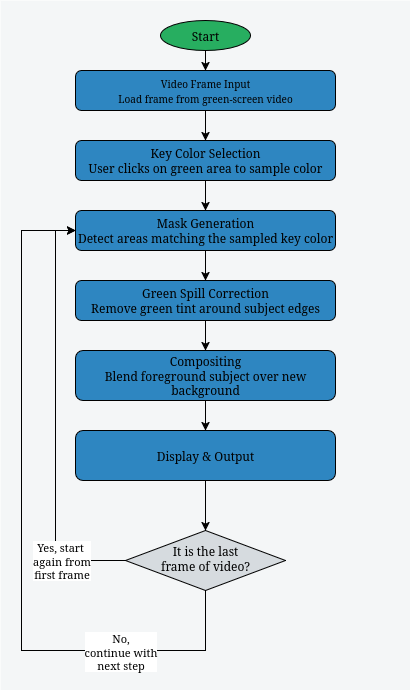

# Chroma Key Compositor

This project implements an interactive chroma-key compositor using OpenCV in C++. It demonstrates fundamental techniques for real-time green-screen removal and compositing, with hands-on controls to explore each stage of the process.

---

## Example Outputs

<div style="display: flex; justify-content: center; overflow-x: auto; width: 80%;">
  <table style="table-layout: auto; border-collapse: collapse;">
    <thead>
      <tr>
        <th style="text-align: left; padding: 8px;">Composite on “Asteroid” Background</th>
        <th style="text-align: left; padding: 8px;">Composite on “Demo” Background</th>
      </tr>
    </thead>
    <tbody>
      <tr>
        <td style="padding: 8px;">
          
        </td>
        <td style="padding: 8px;">
          
        </td>
      </tr>
    </tbody>
  </table>
</div>

> **Tip**: Try swapping in your own background images (or video) to see how well your mask and blending parameters hold up under different scenes.


---

## What It Does

This project is an **interactive chroma key compositor** built with C++ and OpenCV. It allows users to replace green-screen backgrounds in videos with custom backgrounds in real time. Here's what the program does:

1. **Loads a green-screen video** and a replacement background image.
2. **Lets the user click on the video to sample the key color** (typically green), using a mouse-controlled color picker.
3. **Provides GUI sliders (trackbars)** to interactively tune:

   * Key color tolerance
   * Edge softness of the mask
   * Green-spill correction strength
   * Seamless cloning mode toggle
4. **Processes each video frame**:

   * Converts it to HSV and generates a binary mask around the sampled color.
   * Softens the mask for smooth edges.
   * Applies green-spill correction to remove green bleed on the subject.
   * Composites the foreground over the background using either soft blending or OpenCV’s `seamlessClone`.
5. **Displays the live result**, looping the video and updating changes in real time.
6. **Optionally saves example output frames** to disk for inspection.

---

## Build & Run Instructions

Clone the repository and build all projects in one step:

```bash
https://github.com/sancho11/chroma_key.git
cd chroma_key
mkdir build && cd build
cmake ..
make -j$(nproc)
```

Executable will be placed in the bin directory `build/bin/chroma_key`.

To run the project:

```bash
./bin/chroma_key
```

---
## Pipeline Overview

<p align="center">
  
  <br><em>Pipeline Diagram</em>
</p>

---

## Key Concepts

1. **Key Color Sampling**  
   - Click callbacks to pick the chroma key color from the live video frame.  
   - Averaging in a small patch to reduce noise and obtain a stable reference color.

2. **Color Space Transformation**  
   - Converting BGR frames to HSV for robust color-based segmentation.  
   - Calculating a hue–saturation–value tolerance range to isolate pixels near the key color.

3. **Binary Mask Generation**  
   - Creating a hard mask via `cv::inRange()` in HSV space.  
   - Understanding how hue wraps around and why delta calculations must clamp correctly.

4. **Mask Softening**  
   - Inverting and blurring the binary mask to produce a smooth transition edge.  
   - Converting to a floating-point mask in [0..1] to enable soft blending.

5. **Green Spill Correction**  
   - Detecting green spill by comparing the green channel to the maximum of blue and red channels.  
   - Attenuating spill proportionally and redistributing color to preserve natural lighting.

6. **Compositing Techniques**  
   - **Simple Soft Blend**: Per-pixel linear interpolation between foreground and background using the soft mask.  
   - **Seamless Cloning**: OpenCV’s `seamlessClone()` for advanced Poisson blending to hide boundary artifacts.

7. **Interactive Controls**  
   - Trackbars for adjusting tolerance, softness radius, spill-correction strength, and blend mode at runtime.  
   - Real-time feedback to observe how each parameter impacts the final composite.


